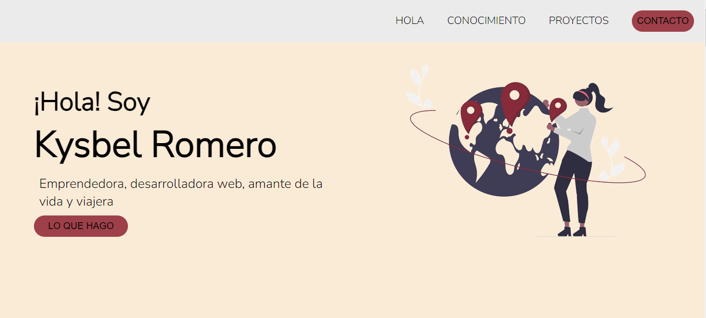

# MI PRIMER PORTAFOLIO

¡Hola! 👋 Bienvenido a mi primer portafolio en GitHub. Éste es mi primer trabajo (grande) presentado y evaluado. Toda la realización de él, estuvo a mi cargo.
Sería ideal que pudieses verlo, ya que es el resultado de muchas noches sin dormir, muchas ganas de llorar y muchas emociones encontradas.

El objetivo de éste fue, poner en práctica todo lo aprendido, hasta ahora, sobre:
 - HTML Semántico
 - Modelo de Caja
 - FlexBox
 - Git
 - GitHub
 - Media queries/ Breakpoints
 - Entre otros...

Primer diseño 👇🏽

Parte de mi código (después de muchas modificaciones) 👇🏽

Diseño final 👇🏽

## Acerca de mí
Mi nombre es Kysbel Romero. Soy venezolana y estudiante de Desarrollo Frontend en ADA ITW en Argentina.
Desde siempre he sido curiosa y precisamente esta cualidad fue lo que me adentró en el mundo del Desarrollo Web.
Constantemente estoy buscando maneras de crecer y aprender. Por eso, te invito a que veas mi evolución en  este camino del Desarrollo Web, a través de este proyecto y de los que, sin duda alguna, vendran...

## Habilidades

- Html
- CSS
- GIT

## Cómo Contactarme

Si quieres estar en contacto conmigo, te invito a que me sigas a través de mi redes sociales. 
¡Me encantaría conectar contigo! Puedes encontrarme en:

- [LinkedIn](https://www.linkedin.com/in/kysbel-romero-988507269/)
- [Correo] (rkysbelss@gmail.com)

¡GRACIAS por visitar mi portafolio ❤️!
